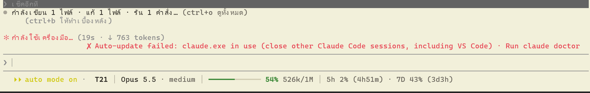
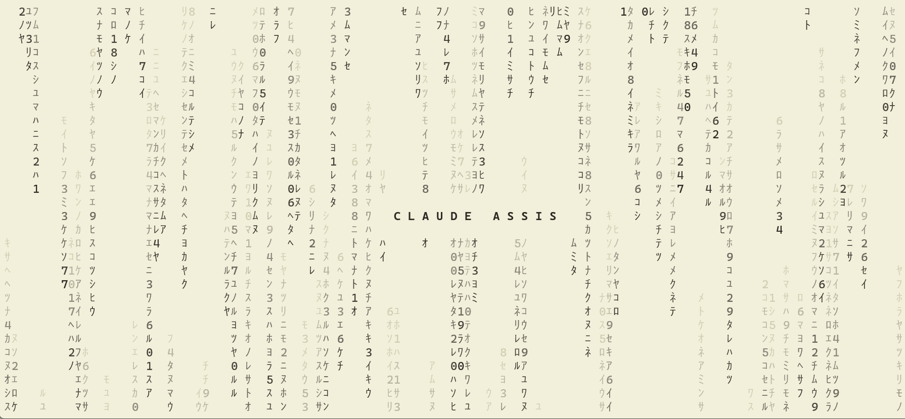
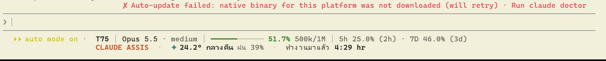

# Claude Code mods: field notes from day one (Windows · Thai)

One long session of building Claude Code mods on Windows 11, written up honestly: **what shipped, what I tried and threw away, and why**. Most mod repos only show the finished screenshot. This one also keeps the failures, because they say more about the mod API than the wins do.

> **Status: experimental, day one.** Built on Claude Code 2.1.291 and still loading on 2.1.292. Tested on one machine: Windows 11, Windows Terminal 1.24, Cascadia Code, a cream background (`#F2F0DA`), 134 columns, fullscreen mode. The mod API is new and may change under you. Issues welcome.

| Piece | Status | One-line lesson |
|---|---|---|
| [fuel-bar](#fuel-bar-context--quota-footer) | in daily use | The engine gives you context, auto-compact threshold and rate limits for free after every turn. No polling, no tokens. |
| [thai-mode](#thai-mode-claude-code-in-thai) | in daily use | You can re-render tool rows, groups, spinner and turn duration. You cannot touch the prompt box. |
| [task-band](#task-band-background-work-above-the-prompt) | new, day two | The engine tells a mod when an agent ends right away, but shell/monitor/workflow ends only reach it at the next tool call while Claude is busy. And there is no progress % for anything. |
| [Matrix intro](#matrix-boot-intro) | in daily use | A sequential intro always leaves a blank gap. Run it in parallel and stop on a file Claude writes before its first frame. |
| [Safe updater](#safe-updater-for-the-npm-install) | in daily use | Auto-update on Windows can leave `claude.exe` as a 500-byte stub. Stage, verify, then rename-and-swap. |
| [Right-side pane + widgets](#tried-and-dropped) | dropped | The dock frame belongs to the engine, and Thai text breaks in the Windows Terminal grid with every font I tried. |
| [project-band above the prompt](#tried-and-dropped) | dropped | Engine notifications render *between* your band and the prompt, and you cannot intercept them. |
| [matrix-rain as a mod](#tried-and-dropped) | dropped | `session.start` fires after the first frame. Too late for a loading screen. |
| [Rounded prompt box](#tried-and-dropped) | not possible | The prompt input is not a render site. |
| [Context Router, prismantis](#considered-and-declined) | declined | Already built in / clashes with thai-mode and adds tokens per prompt. |

---

## fuel-bar: context + quota footer


Two lines under the prompt:

1. `T77 │ Opus 5.5 · medium │ ━━━━━━──── 53.7% 519.3k/1M │ 5h 26.0% (1h57m) · 7D 47.0% (3d)`
   turn · model · effort · gauge **to the auto-compact point** (not to the raw window) · 5-hour and 7-day quota with time to reset.
2. `PROJECT · ✦ 24.2° night rain 39% · worked 4:32 hr`, plus the latest mod toast on the right for 8 seconds.

Why I built it: I was using `ccusage statusline`, and on a 1M-context model it showed context above 100% (147% on my screen). The engine already knows the right numbers.

How it works:

- `session.measure` fires after every turn with `context.tokens`, `context.window` and `rateLimits[]` (`five_hour`, `seven_day`, each with `percentUsed` and `resetsAt`). `session.usage({ breakdown: 'summary' })` adds `autoCompactThreshold`. **Zero tokens, no process spawned.**
- `turn.step` carries the current `effort`.
- It draws into the `PromptHint` render site. If you return two lines, the engine keeps its own mode pill (`⏵⏵ auto mode on`) on the first line and indents the second by the pill's width. I tried drawing my own pill. The engine's pill stays anyway, so I gave up and kept theirs.
- On narrow terminals it drops, in order: the hint text, the reset times, the 5h/7D block, then wraps to two lines. The token count always stays.
- Weather: `ipwho.is` for a rough location, then `api.open-meteo.com`. No keys, cached 30 min. **This sends your IP to ipwho.is.** Delete `loadWeather` if you don't want that.
- `ui.toast` can be intercepted (`return { value: undefined }`), so mod toasts land at the end of line 2 instead of popping over the transcript.
- `dependencies: ["thai-mode"]` in `plugin.json` lets fuel-bar read thai-mode's state and translate the hint itself. Two mods never fight over the same render site.

Colors are hand-picked for a **light cream** background. On a dark theme you'll want to change the `C` palette in `register.tsx`.

## thai-mode: Claude Code in Thai



Rewrites, with a built-in dictionary (no model calls):

- tool rows (`ToolUse`): `Read` → `อ่านไฟล์`, `Bash` → `รันคำสั่ง`, and MCP tools as `service · Thai verb`
- results (`ToolResult`): "read 120 lines (40–159 of 300)", "added 4 · removed 1 lines", with the diff still drawn by the engine's `Code` component
- collapsed groups (`ToolGroup`): `กำลังเขียน 1 ไฟล์ · แก้ 1 ไฟล์ · รัน 1 คำสั่ง…`
- the spinner word by real phase (`requesting / thinking / responding / tool-input / tool-use`)
- turn duration and the `ctrl+b` hint

`/thai` toggles it, and the choice persists in `$.store`.

Things I learned:

- In this version even a single `Edit` gets folded into a `ToolGroup`, so your nice single-row rendering mostly shows up only in `ctrl+o`.
- Command output and diffs stay as they are. Translating those would be lying about what ran.

## task-band: background work above the prompt


A framed band above the prompt (AbovePrompt) titled "งานเบื้องหลัง" (background work). Each running subagent, Workflow, background shell and Monitor gets one chip with its own gauge, 3 per page:

- **Workflow:** agents finished / agents started (1/2) plus elapsed time.
- **Single agent:** an estimated ~62% once this agent type has finished at least 3 times (average kept in $.store), otherwise a sweeping line plus elapsed time.
- **Shell / Monitor:** sweeping line plus elapsed time. Nothing reports real progress.
- Running chips come first, finished ones (✓ / ✗) after them, and finished chips stay until the turn ends. Within each group chips keep the order you started them in.
- When a task starts or ends, the band jumps to its page for 3 seconds. Ctrl+X then Tab focuses the band, ← / → page, Esc goes back to the prompt.

What the API gives you (build 2.1.292):

- gent.spawn answers with an gentId. Its end is 	urn.complete carrying that gentId, and it arrives **immediately**. Workflow agents come through gent.spawn too, with .workflow.runId.
- Background Bash/PowerShell results carry ackgroundTaskId. Monitor and Workflow results carry 	askId (Workflow also 
unId and workflowName).
- Their end arrives as prompt.submit with origin.kind === 'task-notification', with <task-id> and <status> in the text. When Claude is idle that is instant. While a turn runs it waits for the next tool-call boundary (I measured 4.3 s late).
- Results of tool calls sent in parallel come back in any order. To keep chips in the order you started them, take the order key when the hook is entered, **before** wait next(e).

Things that bit me:

- Box takes orderStyle but has no border title. Laying a position: "absolute" title over the border line shifted the whole screen sideways and left it garbled until a resize forced a full redraw. The frame is now three plain Text rows sized to odyColumns (the engine draws [-] at the far right of the band).
- Windows Terminal gives Thai above/below marks zero cells, the same as the engine does. Don't pad widths to "fix" the mis-spaced look. It only misaligns the frame.
- Engine notices still render between the band and the prompt (the reason project-band was dropped). Here it matters less, because the band is only there while something runs.

## Matrix boot intro



Katakana rain in ink-on-cream with the folder name decoding in the middle, shown **while** Claude Code loads (about 4.7 s on this laptop). It is not a mod. It is a tiny C# exe started by the launcher.

The path there was three failures:

1. **Intro first, then `claude`.** However long the intro runs, you still get a blank or log-only screen between the intro ending and Claude's first frame.
2. **Intro as a mod.** `session.start` fires *after* Claude has drawn its first screen. The rain lands on top of Claude, and in fullscreen mode Ctrl+L does not clear it.
3. **Intro in PowerShell.** pwsh takes ~0.9 s to start and ~1.5 s to set up, so the first second is blank anyway.

What works:

- `claude-launcher.cmd` does `start "" /b matrix-intro.exe` and then `call claude` at the same moment. The rain shows within ~0.7 s.
- The exe polls `numStartups` in `<CLAUDE_CONFIG_DIR>\.claude.json` every 120 ms. Claude bumps it 0.4–0.7 s before drawing its first frame, which is the "ready" signal. Hard cap: 20 s.
- Claude's fullscreen mode uses the alternate screen, so the rain on the main screen is hidden behind it. After Claude exits, the launcher runs `cls`, but only if the intro actually ran (it drops a marker file).
- The intro is skipped for `-p`, `--version`, `--help` and subcommands. `CLAUDE_MATRIX_INTRO=0` disables it.

**Batch trap:** `claude` installed by npm is `claude.cmd`. If you write `claude %*` instead of `call claude %*` in a `.cmd`, nothing after that line ever runs.

Half-width katakana take exactly one cell in Windows Terminal with Cascadia Code, so the columns line up.

Build it with the C# compiler that ships with Windows:

```bat
C:\Windows\Microsoft.NET\Framework64\v4.0.30319\csc.exe /nologo /optimize+ /codepage:65001 windows\matrix-intro.cs
```

## Safe updater for the npm install

On this machine, Claude Code's own auto-update repeatedly left `node_modules\@anthropic-ai\claude-code\bin\claude.exe` as a ~500-byte stub ("This version of claude.exe is not compatible…"), or failed with "claude.exe in use" while another session was open. Its warning also showed up in the middle of the screen:



`windows/claude-update-safe.ps1`:

1. Takes a global mutex, so two launches don't race.
2. Compares the installed version with `npm view @anthropic-ai/claude-code version`.
3. Installs the new version into a staging folder, picks the real binary (≥10 MB), and checks `--version`.
4. **Renames** the live exe to `claude.exe.old-<timestamp>` (Windows allows renaming a running exe, not overwriting it), then moves the new one in. Open sessions keep running the old file. New sessions get the new one.
5. Cleans up old `.old-*` files on the next run, and logs to `%LOCALAPPDATA%\claude-update-safe\claude-update.log`.

Set `"env": { "DISABLE_AUTOUPDATER": "1" }` in `settings.json` so the built-in updater stops fighting it. matrix-intro.exe launches the script hidden at every start if it sits in the same folder.

This only applies to the **global npm install**. The native installer manages its own versioned folders.

## Tried and dropped

**Right-side pane with widgets** (project name, a 3-tab reminder list, weather, other open sessions). Inspired by paneline and flightdeck. It worked technically (`Pane` render site with `fullscreen: true`), but:

- The dock frame and its colors belong to the engine and follow the Claude Code theme, not yours.
- Thai text in Windows Terminal is mis-spaced: combining vowels and tone marks get their own cell (`เ ปิด`). I tried Noto Sans Thai, Leelawadee, Tahoma, Tlwg Mono and Tlwg Typo. None fixed it. This is a WT grid limit, not a font problem.
- While the dock is open, `viewport.columns` in `PromptHint` is the transcript width, not the full window.
- Below 144 columns the pane doesn't open by itself. On a 134-column window you have to open it once with `/pane`.

**project-band above the prompt** (`AbovePrompt`, one line: project · weather · time worked). It looked good until Claude Code showed its own notice (`Auto-update failed …`). Engine notices render **between** `AbovePrompt` and the prompt, and they are standing warnings, not `ui.toast`, so a mod can't catch them. I merged the band into fuel-bar's second line instead.

**matrix-rain as a mod.** See the intro section: `session.start` is too late.

**Rounded prompt box.** I mocked it in a browser first. That was a mistake, because the prompt input is not one of the render sites, so a mod can't change it. A custom theme can recolor the border (`promptBorder`) but not reshape it.

## Considered and declined

- **Context Router** (load different context per folder). Claude Code already does this: it loads `CLAUDE.md` from parent folders, and `@path` imports work.
- **prismantis.** Its default theme is dark. It also re-renders `ToolUse`, `ToolGroup` and `TurnDuration` (the same sites as thai-mode), and its `diagramHints` adds about 190 tokens to every prompt.

## A warning about mod screenshots

The HUD in one popular mod's demo video (LIFE / LEVEL / XP bars across the top) is rendered with Revideo in its `demo/` folder. The README says as much: "Nothing in it is captured". It isn't something the mod draws in your terminal. Before you promise someone a feature you saw in a GIF, grep the mod's `hooks/` folder.

## Testing on the real terminal (Windows)

Mockups in a browser lie about fonts, colors and cell widths. What I used instead:

- Launch a fresh window with `wt -w new <file.cmd>`. `Start-Process` with arguments quotes the whole command line and fails with `0x80070002`.
- Find the window by class `CASCADIA_HOSTING_WINDOW_CLASS`. Capture it with `PrintWindow(hwnd, dc, 2)` after `SetProcessDPIAware()`. That works even when the window is behind another one. `CopyFromScreen` only sees what's visible.
- Type with `SendInput` + `KEYEVENTF_UNICODE`. `SendKeys` follows the active keyboard layout: with Thai active, `/exit` arrives as `/59`.

## Install

```powershell
claude plugin marketplace add <path-to-clone>\mods
claude plugin install fuel-bar@field-notes-mods --scope user
claude plugin install thai-mode@field-notes-mods --scope user
claude plugin install task-band@field-notes-mods --scope user
```

Plugins are read from that folder in place: edit a file, then run `/reload-plugins`. `claude plugin test <folder>` runs the tests (fuel-bar 7, thai-mode 5, task-band 13).

For the intro: compile `windows/matrix-intro.cs`, then put `matrix-intro.exe`, `claude-update-safe.ps1` and `claude-launcher.cmd` in one folder on your `PATH`.

---

## ภาษาไทย (สรุป)

บันทึกการทำ mod ให้ Claude Code บน Windows ในหนึ่งวัน ทั้งชิ้นที่ใช้จริงและชิ้นที่ลองแล้วทิ้ง

- **fuel-bar:** แถบ 2 บรรทัดใต้ช่องพิมพ์ แสดง turn, โมเดล, effort, เกจ context (นับถึงจุด auto-compact), โควตา 5 ชม./7 วัน, ชื่อโปรเจกต์, อากาศ และเวลาที่ทำงานมาแล้ว ข้อมูลมาจาก engine หลังจบแต่ละ turn จึงไม่กิน token
- **thai-mode:** แปลแถวเครื่องมือ, แถวสรุปที่พับไว้, spinner และเวลาที่ใช้ต่อ turn เป็นภาษาไทยด้วยพจนานุกรมในตัว `/thai` ใช้สลับเปิด/ปิด
- **task-band:** กรอบ "งานเบื้องหลัง" เหนือช่องพิมพ์ แสดง agent, Workflow, คำสั่งเบื้องหลัง และ Monitor ทีละ 3 งาน แต่ละงานมีเกจของตัวเอง งานที่รันอยู่ขึ้นก่อน กด Ctrl+X แล้ว Tab เพื่อเลื่อนหน้าด้วยลูกศร
- **Matrix intro:** แสดงฝนตัวอักษรระหว่างรอ Claude โหลด ต้องรันขนานกับ Claude และหยุดเมื่อ `numStartups` เพิ่ม ถ้ารันเรียงกันจะมีจอว่างเสมอ
- **ตัวอัปเดตปลอดภัย:** แก้ปัญหา auto-update ทำให้ `claude.exe` เหลือไฟล์ 500 ไบต์ ใช้วิธีติดตั้งแยกไว้ก่อน ตรวจว่าใช้ได้ แล้วค่อยเปลี่ยนชื่อสลับไฟล์
- **ที่ลองแล้วไม่เวิร์ค:**
  - แผงด้านขวา: กรอบเป็นของ engine และสระ/วรรณยุกต์ไทยเพี้ยนใน Windows Terminal ทุกฟอนต์ที่ลอง
  - แถบเหนือช่องพิมพ์: แจ้งเตือนของ Claude Code ขึ้นมาคั่นกลาง และ mod ดักไม่ได้
  - ฝน Matrix แบบ mod: `session.start` มาช้ากว่าจอแรก
  - กรอบช่องพิมพ์มุมมน: API ไม่เปิดให้แก้

ถ้าใช้ Windows Terminal กับภาษาไทย ให้เตรียมใจไว้ว่าสระบนและวรรณยุกต์จะกินช่องของตัวเอง ฟอนต์แก้ไม่ได้

## License

MIT
